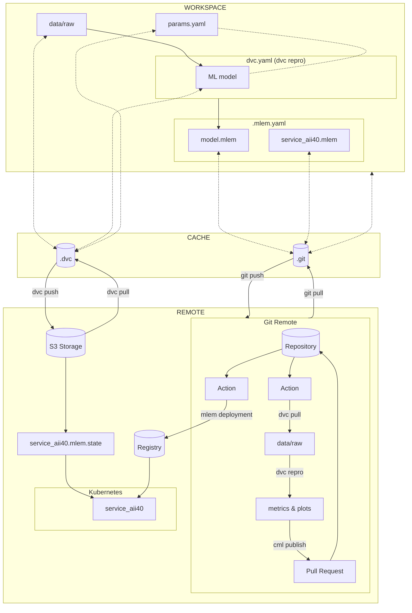

# AII 4.0 Pipeline TSAD

This repository contains the implementation of a complete MLOps pipeline for the models of the [TSAD benchmark](https://github.com/AII4-0/tsad-benchmark) repository.

## Overview

The pipeline consists of two main sections:
* a model tailored for staged processing, using [Git](https://git-scm.com/) and [DVC](https://dvc.org/).
* a training, monitoring, and deployment pipeline, using [CML](https://cml.dev/), [MLEM](https://mlem.ai/), [GitHub Actions](https://docs.github.com/en/actions) and the [GCloud](https://cloud.google.com/) infrastructure.

### Staged model

The ML model undergoes adjustments to incorporate staged steps, allowing for efficient caching.
DVC also orchestrates the model pipeline, ensuring versioning and reproducibility of both data and code.
Upon successful completion of all stages, the model, converted to C, is prepared for deployment on an edge instance.

The provided DVC pipeline diagram illustrates the different stages involved in the machine learning workflow.

* **Prepare**: retrieval of data from the remote S3 bucket on GCloud and preprocessing.
* **Train**: actual training of the ML model using the prepared data on the train set, allowing the model to learn patterns and features from the dataset.
* **Test**: assessment of the performance of the trained model on the test set.
* **Evaluate**: comprehensive assessment of the model's performance. Evaluation metrics are calculated to gauge how well the model generalizes to new data, ensuring the model meets the desired criteria for deployment.
* **Convert**: conversion of the trained ML model from Pytorch to C, to make it ready for deployment on resource-constrained environments.
* **Check**: ensures the integrity and compatibility of the converted C model. This steps verifies that the converted model meets the necessary specifications.

The provided DVC pipeline diagram illustrates the different stages involved in the machine learning workflow.

```
         +---------+
         | prepare |
         +---------+
              *
              *
              *
          +-------+
          | train |
          +-------+
          *        *
        **          **
       *              *
  +------+         +---------+
  | test |         | convert |
  +------+         +---------+
      *                 *
      *                 *
      *                 *
+----------+        +-------+
| evaluate |        | check |
+----------+        +-------+
```

### Pipeline

The MLOPs pipeline allows for:
* **Versioning**, with both the codebase and dataset being versioned, ensuring traceability and reproducibility across different iterations.
* **CI/CD Integration**, allowing for executing experiments on a clean machine, triggered automatically on pull requests.
* **Visualization and Monitoring**, with changes made to a model being visualized using parameters, metrics, and plots, helping in the
identification of differences between model iterations (see [PR example](https://github.com/AII4-0/aii4.0-pipeline/pull/2)).
* **Review Process**, with changes to the model undergoing a thorough review and discussion before integration into the codebase.
This ensures quality control and collaboration among team members.
* **Artifact Management**, as the model can be saved and loaded for future usage on the Google Artifact Registry. This includes both model parameters and associated data.
* **Deployment and Accessibility**, with the model being designed for easy integration outside of the experiment context, and it can be accessed from a Kubernetes cluster.
* **Continuous deplyment**, with the use of the CI/CD pipeline to ensure the latest version is always available in the production environment (Kubernetes cluster on GClouds).




## Set up the pipeline

**Note**: The following assumes an existing GCloud account with a valid billing account.

Ensure the GCloud [Artifact Registry](https://console.cloud.google.com/flows/enableapi?apiid=artifactregistry.googleapis.com)
and [Kubernetes Engine API](https://console.cloud.google.com/flows/enableapi?apiid=container.googleapis.com) APIs are enabled.


Launch the Kubernetes cluster:
```shell
export GCP_CLUSTER_NAME=mlops-kubernetes
export GCP_CLUSTER_ZONE=europe-west6-a

gcloud container clusters create \
--machine-type=e2-standard-2 \
--num-nodes=2 \
--zone=$GCP_CLUSTER_ZONE \
$GCP_CLUSTER_NAME
```

Create the artifact repository:
```shell
export GCP_PROJECT_ID=aii40-405810
export GCP_REPOSITORY_NAME=mlops-registry
export GCP_REPOSITORY_LOCATION=europe-west6

gcloud artifacts repositories create $GCP_REPOSITORY_NAME \
--repository-format=docker \
--location=$GCP_REPOSITORY_LOCATION
```

## Set model development

Steps to develop and incrementally improve the model.

Install required dependencies in a virtual environment.

```shell
# Create a virtual environment
python3 -m venv .venv
# Activate the virtual environment
source .venv/bin/activate
# Install the dependencies
pip install -r requirements/requirements-dev.txt
```

To run the DVC pipeline locally:

```shell
dvc pull
dvc repro
```

Make your changes to the model code and parameters, then commit on a branch.

```shell
dvc repro
dvc push
git commit -a -m "My changes for better model performances"
git push
```

Open a new PR on GitHub and observe the new metrics (see [PR example](https://github.com/AII4-0/aii4.0-pipeline/pull/2)).
Review and discuss the changes, then merge them in the main branch or discard as necessary.

## Resources clean up

If you don't need the resource anymore, ensure to remove the resources and environments created as to avoid unnecessary incurring costs.

```shell
gcloud container clusters delete --zone $GCP_CLUSTER_ZONE $GCP_CLUSTER_NAME
gcloud artifacts repositories delete --location $GCP_REPOSITORY_LOCATION $GCP_REPOSITORY_NAME
```

You can also disable the GCloud APIs.

## References

* [A guide to MLOps](https://mlops.swiss-ai-center.ch/), Swiss AI Center & HES-SO.
